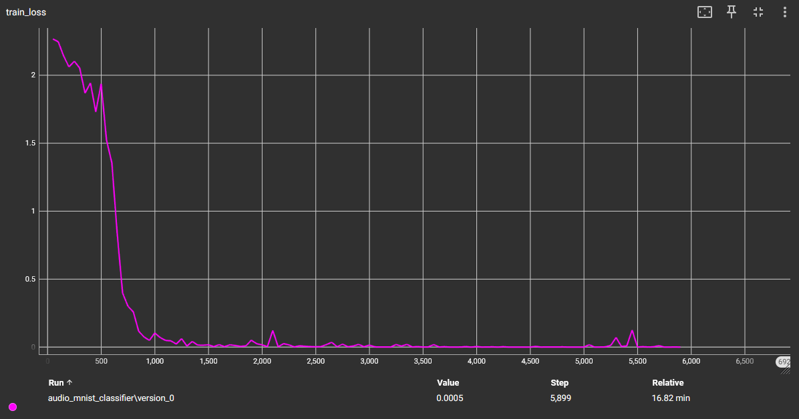
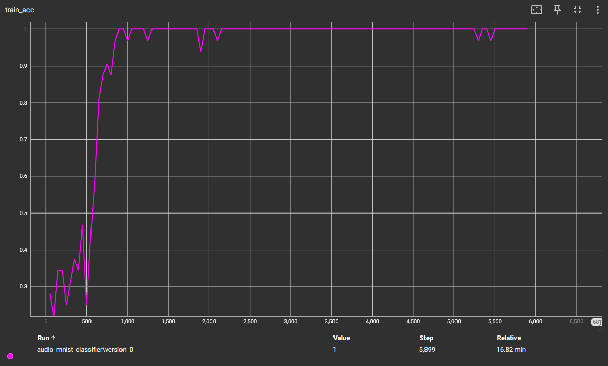
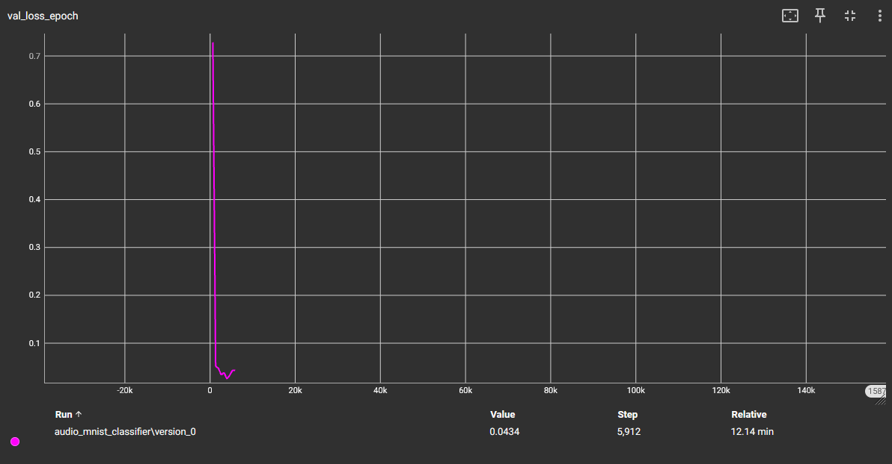
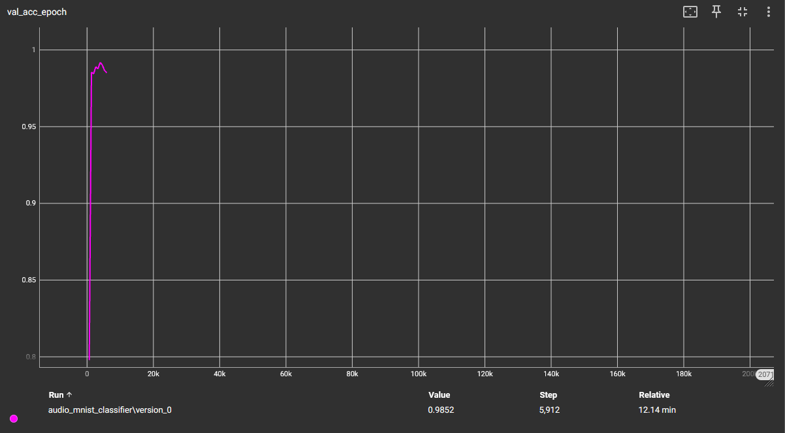

# MNIST audio classification using Pytorch

## Dataset

The original dataset is available in https://www.kaggle.com/datasets/sripaadsrinivasan/audio-mnist

## CNN model

### Model Summary

The following table shows the model architecture.

<table style="font-family: monospace;">
    <caption>
        <b>Model summary</b>
    </caption>
    <thead>
        <tr><th> Layer (type) </th><th> Output Shape </th><th> Param # </th></tr>
    </thead>
    <tbody>
        <tr><td> Conv2d-1 </td>    <td> [-1, 10, 1023, 30] </td> <td> 260 </td>         </tr>
        <tr><td> ReLU-2 </td>      <td> [-1, 10, 1023, 30] </td> <td> 0 </td>           </tr>
        <tr><td> MaxPool2d-3 </td> <td> [-1, 10, 511, 15] </td>  <td> 0 </td>           </tr>
        <tr><td> Conv2d-4 </td>    <td> [-1, 20, 509, 13] </td>  <td> 5,020 </td>       </tr>
        <tr><td> ReLU-5 </td>      <td> [-1, 20, 509, 13] </td>  <td> 0 </td>           </tr>
        <tr><td> MaxPool2d-6 </td> <td> [-1, 20, 254, 6] </td>   <td> 0 </td>           </tr>
        <tr><td> Flatten-7 </td>   <td> [-1, 30480] </td>        <td> 0 </td>           </tr>
        <tr><td> Linear-8 </td>    <td> [-1, 3800] </td>         <td> 115,827,800 </td> </tr>
        <tr><td> ReLU-9 </td>      <td> [-1, 3800] </td>         <td> 0 </td>           </tr>
        <tr><td> Dropout-10 </td>  <td> [-1, 3800] </td>         <td> 0 </td>           </tr>
        <tr><td> Linear-11 </td>   <td> [-1, 1024] </td>         <td> 3,892,224 </td>   </tr>
        <tr><td> ReLU-12 </td>     <td> [-1, 1024] </td>         <td> 0 </td>           </tr>
        <tr><td> Dropout-13 </td>  <td> [-1, 1024] </td>         <td> 0 </td>           </tr>
        <tr><td> Linear-14 </td>   <td> [-1, 256] </td>          <td> 262,400 </td>     </tr>
        <tr><td> ReLU-15 </td>     <td> [-1, 256] </td>          <td> 0 </td>           </tr>
        <tr><td> Dropout-16 </td>  <td> [-1, 256] </td>          <td> 0 </td>           </tr>
        <tr><td> Linear-17 </td>   <td> [-1, 10] </td>           <td> 2,570 </td>       </tr>
    </tbody>
    <tfoot>
        <tr>
        <td colspan="3" style="border-top: 1px solid black;">
            Total params: 119,990,274 
            Trainable params: 119,990,274 
            Non-trainable params: 0 
            Input size (MB): 0.13 
            Forward/backward pass size (MB): 7.87 
            Params size (MB): 457.73 
            Estimated Total Size (MB): 465.72 
        </td>
        </tr>
    </tfoot>
</table>

### Results

#### Training parameters

| Parameter         | Value                                                     |
|-------------------|-----------------------------------------------------------|
| Loss function     | CrossEntroppyLoss                                         |
| Optimizer         | Adam                                                      |
| Learning rate     | 10^-3                                                     |
| Audio sample rate | 16 KHz                                                    |
| Dataset size      | 30000 samples                                             |
| Dataset split     | 70% train / 20% validation / 10% test                     |
| Batch size        | 32                                                        |
| Epochs            | 15                                                        |
| Early stopping    | Patience = 3 epochs \| Delta = 0.00 \| Monitor = Accuracy |
| Device            | CUDA GPU (NVIDIA GeForce RTX 3050 Laptop GPU)             |

#### Evaluation Results

| Metric                | Training | Validation                    | Test   |
|-----------------------|----------|-------------------------------|--------|
| Accuracy (%)          | 1.000    | 0.986 (best 0.991 at epoch 4) | 0.9896 |
| Loss                  | 0.000139 | 0.0613                        | 0.0458 |

> Note: Effective training duration was 7 epochs — best validation at epoch 4, with early stopping patience set to 3 and the accuracy was 0.991.

##### Training Statistics

<figure style="text-align: center;">
  
  <figcaption>Training loss</figcaption>
</figure>

<figure style="text-align: center;">
  
  <figcaption>Training accuracy</figcaption>
</figure>

<figure style="text-align: center;">
  
  <figcaption>Validation loss</figcaption>
</figure>

<figure style="text-align: center;">
  
  <figcaption>Validation accuracy</figcaption>
</figure>

## CNN + LSTM model

### Model Summary

The following table shows the model architecture.

<table>
  <caption>
    <b>Model summary</b>
  </caption>
  <thead>
    <tr><th> Layer (type:depth-idx) </th><th> Output Shape </th><th> Param # </th></tr>
  </thead>
  <tbody>
    <tr> <td> Conv2d: 2-1 </td> <td> [1, 20, 1025, 32] </td> <td> 200 </td> </tr>
    <tr> <td> ReLU: 2-2 </td> <td> [1, 20, 1025, 32] </td> <td> -- </td> </tr>
    <tr> <td> MaxPool2d: 2-3 </td> <td> [1, 20, 512, 16] </td> <td> -- </td> </tr>
    <tr> <td> LSTM: 1-2 </td> <td> [1, 4, 128] </td> <td> 21,038,080 </td> </tr>
    <tr> <td> Linear: 1-3 </td> <td> [1, 10] </td> <td> 1,290 </td> </tr>
  </tbody>
  <tfoot>
    <tr>
      <td colspan="3" style="border-top: 1px solid black;">
          Total params: 21,039,570 
          Trainable params: 21,039,570 
          Non-trainable params: 0 
          Total mult-adds (Units.MEGABYTES): 90.71 
      </td>
    </tr>
    <tr>
      <td colspan="3" style="border-top: 1px solid black;">
          Input size (MB): 0.13 
          Forward/backward pass size (MB): 5.25 
          Params size (MB): 84.16 
          Estimated Total Size (MB): 89.54 
      </td>
    </tr>
  </tfoot>
</table>

### Results

#### Training parameters

| Parameter         | Value                                                     |
|-------------------|-----------------------------------------------------------|
| Loss function     | CrossEntroppyLoss                                         |
| Optimizer         | Adam                                                      |
| Learning rate     | 10^-3                                                     |
| Audio sample rate | 16 KHz                                                    |
| Dataset size      | 30000 samples                                             |
| Dataset split     | 70% train / 20% validation / 10% test                     |
| Batch size        | 32                                                        |
| Epochs            | 15                                                        |
| Early stopping    | Patience = 3 epochs \| Delta = 0.00 \| Monitor = Accuracy |
| Device            | CUDA GPU (NVIDIA GeForce RTX 3050 Laptop GPU)             |

#### Evaluation Results

| Metric                | Training | Validation                    | Test   |
|-----------------------|----------|-------------------------------|--------|
| Accuracy (%)          | 1.000    | 0.985 (best 0.991 at epoch 5) | 0.9900 |
| Loss                  | 0.00266  | 0.0434                        | 0.0347 |

> Note: Effective training duration was 8 epochs — best validation at epoch 5, with early stopping patience set to 3 and the accuracy was 0.991.

##### Training Statistics

<figure style="text-align: center;">
  
  <figcaption>Training loss</figcaption>
</figure>

<figure style="text-align: center;">
  
  <figcaption>Training accuracy</figcaption>
</figure>

<figure style="text-align: center;">
  
  <figcaption>Validation loss</figcaption>
</figure>

<figure style="text-align: center;">
  
  <figcaption>Validation accuracy</figcaption>
</figure>